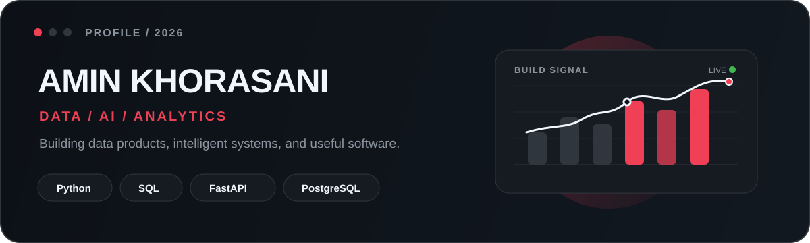
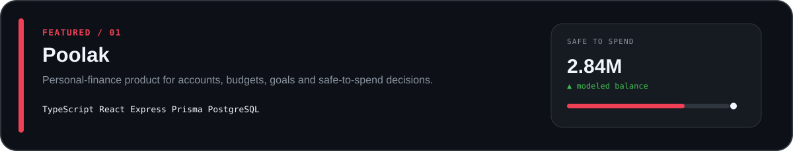
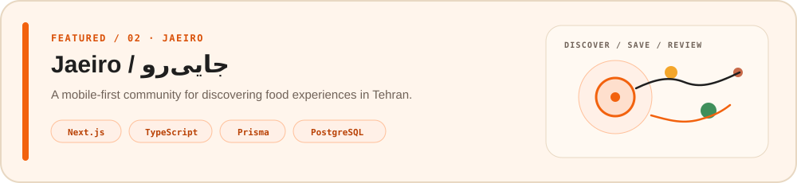
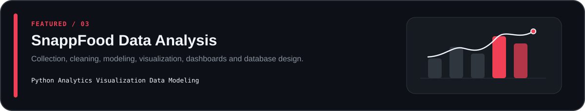

  

  <strong>Data · AI · Analytics · Product Engineering</strong> 
  Turning messy systems into clear decisions and useful software.

  <a href="https://github.com/AminKhorasani?tab=repositories">Repositories</a>
  &nbsp;·&nbsp;
  <a href="https://github.com/AminKhorasani/Poolak">Poolak</a>
  &nbsp;·&nbsp;
  <a href="https://github.com/AminKhorasani/jaeiro">Jaeiro</a>

---

## About

I build at the intersection of **analytics, AI, data systems, and product**.

Most of my work starts with an ambiguous problem: a metric that needs explanation, a workflow that should be automated, a backend that needs structure, or an idea that needs to become a real product.

I like building systems that do more than report what happened — they should help explain **why it happened, what matters, and what to do next**.

  

---

## Featured work

 

<table>
  <tr>
    <td width="16%" align="center" valign="middle">
      
    </td>
    <td width="84%" valign="middle">
      
    </td>
  </tr>
</table>

 

---

## Stack

  
  
  
  
  
  
  
  

  Python · SQL · FastAPI · PostgreSQL · Docker · React · Next.js · TypeScript

---

## GitHub signal

  
  

---

## Current direction

> **Analytics as a product.**

I’m especially interested in systems that combine **data, reasoning, and software** into one experience — where an analytical product can detect change, explain drivers, preserve context, and support better decisions.

  0D1117 · 161B22 · F0F6FC · 8B949E · EF4056

